``` r
# Importing the data set 
library(readxl)
state<-read_excel("STATE_ED_1997_corrected.xlsx")
state
```

    ## # A tibble: 50 × 10
    ##    STATE REGION Total_Public_School_…¹ Pupils_per_Teacher Average_Annual_Salar…²
    ##    <chr>  <dbl>                  <dbl>              <dbl>                  <dbl>
    ##  1 Conn…      1                 517935               14.4                  50426
    ##  2 Maine      1                 213569               13.9                  33800
    ##  3 Mass…      1                 915007               14.6                  43806
    ##  4 New …      1                 194171               15.7                  36867
    ##  5 New …      1                1197381               13.8                  49349
    ##  6 New …      1                2813230               15.5                  49560
    ##  7 Penn…      1                1787533               17                    47429
    ##  8 Rhod…      1                 149799               14.3                  43019
    ##  9 Verm…      1                 105565               13.8                  37200
    ## 10 Illi…      2                1943623               17.1                  42679
    ## # ℹ 40 more rows
    ## # ℹ abbreviated names: ¹​Total_Public_School_Enrollment,
    ## #   ²​Average_Annual_Salary_for_Public
    ## # ℹ 5 more variables: Expenditure_per_Pupil <dbl>,
    ## #   Graduates_as_percentage_of_fall_ <dbl>, Average_SAT_verbal_in_1997 <dbl>,
    ## #   Average_SAT_math_in_1997 <dbl>, Percentage_of_Eligible_Students_ <dbl>

``` r
names(state)
```

    ##  [1] "STATE"                            "REGION"                          
    ##  [3] "Total_Public_School_Enrollment"   "Pupils_per_Teacher"              
    ##  [5] "Average_Annual_Salary_for_Public" "Expenditure_per_Pupil"           
    ##  [7] "Graduates_as_percentage_of_fall_" "Average_SAT_verbal_in_1997"      
    ##  [9] "Average_SAT_math_in_1997"         "Percentage_of_Eligible_Students_"

``` r
#==== Assumptions required for multiple linear regression ====
# (1) Normality - all variables should be quantitative and normally distributed with no extreme outliers
# (2) Linearity - all pairs of variables must be linearly related
# (3) No multicollinearity - X1 and X2 are not highly correlated
# (4) No interactions between X1 and X2 as predictors of Y - slope relating Y and X1 must not differ across levels of X2

Y <- state$Expenditure_per_Pupil
X1 <- state$Average_Annual_Salary_for_Public
X2 <- state$Pupils_per_Teacher

# Getting descriptive statistics for each variable 
summary(state$Average_Annual_Salary_for_Public)
```

    ##    Min. 1st Qu.  Median    Mean 3rd Qu.    Max. 
    ##   26764   32001   35837   36532   40412   50647

``` r
  sd(state$Average_Annual_Salary_for_Public)
```

    ## [1] 6237.225

``` r
summary(state$Pupils_per_Teacher)
```

    ##    Min. 1st Qu.  Median    Mean 3rd Qu.    Max. 
    ##   13.80   15.43   16.75   16.81   17.50   24.00

``` r
  sd(state$Pupils_per_Teacher)
```

    ## [1] 2.219488

``` r
summary(state$Expenditure_per_Pupil)
```

    ##    Min. 1st Qu.  Median    Mean 3rd Qu.    Max. 
    ##    3656    4882    5768    5905    6434    9774

``` r
  sd(state$Expenditure_per_Pupil)
```

    ## [1] 1362.807

``` r
# Boxplots to check for outliers 
boxplot(state$Average_Annual_Salary_for_Public, 
  main = "Average Annual Salary for Public School Teachers")
```

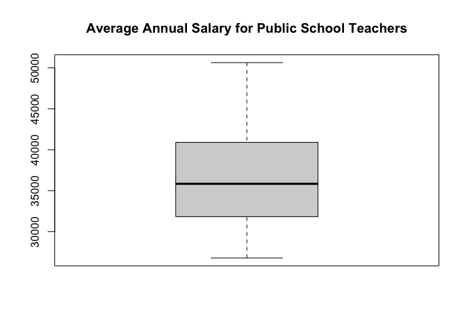<!-- -->

``` r
  # no outliers 
boxplot(state$Pupils_per_Teacher, 
  main = "Average Number of Pupils per Teacher")
```

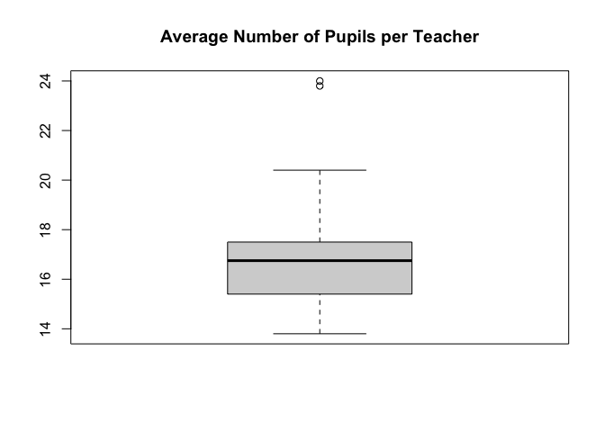<!-- -->

``` r
  # 2 outliers 
boxplot(state$Expenditure_per_Pupil, main = "Average Expenditure per Pupil")
```

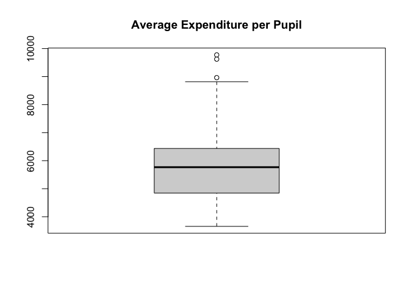<!-- -->

``` r
  # 3 outliers 
## outliers do not appear to be extreme enough to have significant impact on the data - mean and median are relatively close meaning outliers do not have much of an effect, they will be kept in data set. 

# Histograms to check (1)
hist(state$Average_Annual_Salary_for_Public, 
     main = "Average Annual Salary for Public School Teachers")
```

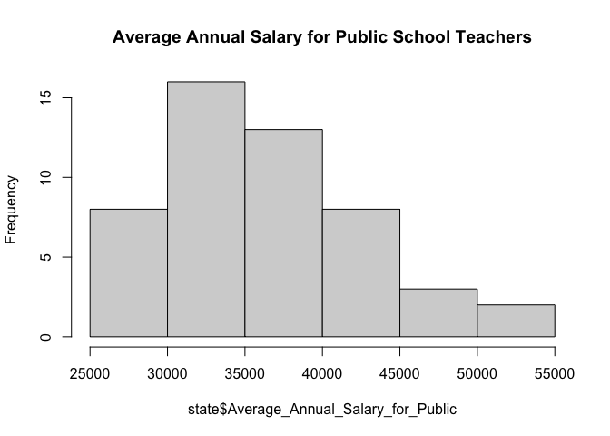<!-- -->

``` r
hist(state$Pupils_per_Teacher, 
     main = "Average Number of Pupils per Teacher")
```

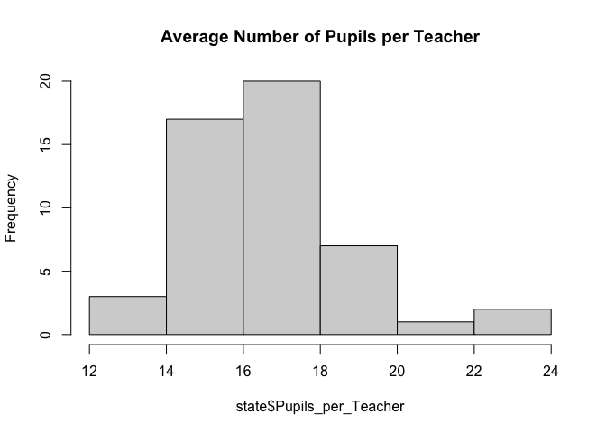<!-- -->

``` r
hist(state$Expenditure_per_Pupil, 
     main = "Average Expenditure per Pupil")
```

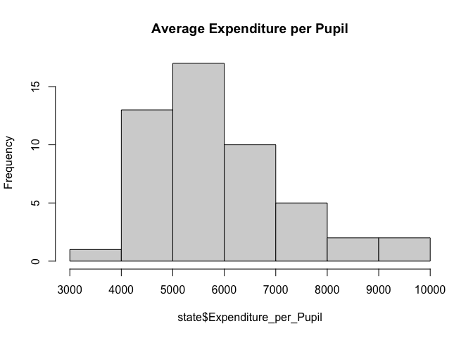<!-- -->

``` r
## all variables are approximately normally distributed 

# Scatter plots for all pairs of variables 
pairs(state[,4:6], upper.panel = NULL)  

# Zero order correlation coefficients 
cor(state$Average_Annual_Salary_for_Public, state$Expenditure_per_Pupil)
```

    ## [1] 0.8534569

``` r
cor(state$Pupils_per_Teacher, state$Expenditure_per_Pupil)
```

    ## [1] -0.3683664

``` r
cor(state$Average_Annual_Salary_for_Public, state$Pupils_per_Teacher)
```

    ## [1] 0.003552086

``` r
## Scatter plots show a linear relationship between X1 & Y and X2 & Y, but it seems X1 & X2 are not linearly related. This could be a possible violation of assumption (2). Correlation coefficients show high positive correlation btwn X1 and Y, moderate negative correlation btwn X2 and Y, and a very weak correlation between X1 and X2. Assumption (2) is partially met, and assumption (3) is met.

# Scatter plot w/ fit line not accounting for X2
library(ggplot2)
```

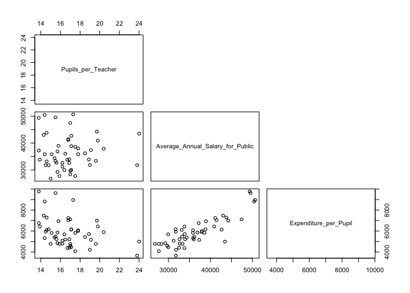<!-- -->

``` r
ggplot(state, aes(x=Average_Annual_Salary_for_Public, y=Expenditure_per_Pupil)) +
  geom_point(size=2, alpha=.5, aes(color=factor(Pupils_per_Teacher))) +
  theme_classic() + 
  labs(color="Avg Pupils per Teacher") + 
  geom_smooth(method = lm, color="black") + 
  scale_color_discrete(name = "Avg Pupils per Teacher")
```

    ## `geom_smooth()` using formula = 'y ~ x'

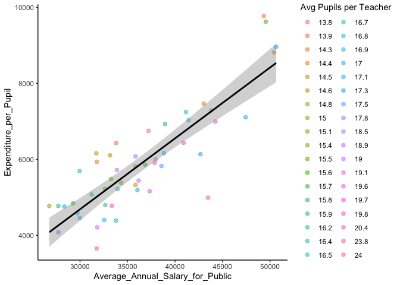<!-- -->

``` r
# Scatter plot with fit line for each level of X2                                                   (binned intervals of 1)
intervals <- seq(13, 24, by = 1)
state$bins <- cut(state$Pupils_per_Teacher, breaks = intervals)
library(ggplot2)
ggplot(state, aes(x = Average_Annual_Salary_for_Public, y = Expenditure_per_Pupil)) +
  geom_point(alpha = 0.5, size = 2, aes(color = bins)) +
  geom_smooth(method = "lm", se = FALSE, aes(group = bins)) +
  scale_color_discrete(name = "Avg Pupils per Teacher") +
  labs(x = "Average Annual Salary for Public", y = "Expenditure per Pupil") +
  theme_classic() +
  facet_wrap(~ bins)
```

    ## `geom_smooth()` using formula = 'y ~ x'

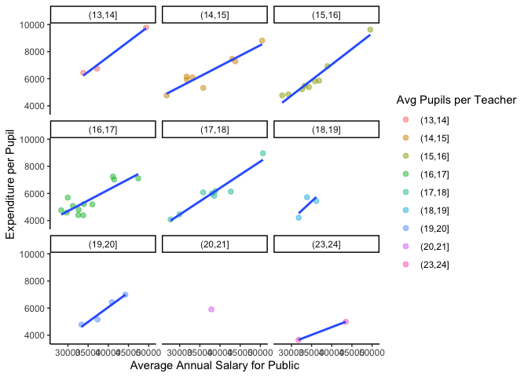<!-- -->

``` r
## Assumption (4) met - no interaction between X1 and X2 as predictors of Y,
  #slopes of fit lines do not change too much between levels of X2
  #slope of fit line in 1st plot seems to be on average slightly steeper than the slopes of the lines in 2nd plot but not too much 
```

``` r
#==== Hypotheses ====
# Null Hypothesis 1 - H0: b1 = 0
# Alt Hypothesis 1 - H1: b1 dne 0

# Null Hypothesis 2 - H0: b2 = 0
# Alt Hypothesis 2 - H1: b2 dne 0
```

``` r
#==== Fitting Regression Model ====
model1<-lm(state$Expenditure_per_Pupil~state$Average_Annual_Salary_for_Public+state$Pupils_per_Teacher)
analysis<-summary(model1)
analysis
```

    ## 
    ## Call:
    ## lm(formula = state$Expenditure_per_Pupil ~ state$Average_Annual_Salary_for_Public + 
    ##     state$Pupils_per_Teacher)
    ## 
    ## Residuals:
    ##      Min       1Q   Median       3Q      Max 
    ## -1031.01  -341.13     9.56   361.76   984.86 
    ## 
    ## Coefficients:
    ##                                          Estimate Std. Error t value Pr(>|t|)
    ## (Intercept)                            2916.81444  698.47643   4.176 0.000127
    ## state$Average_Annual_Salary_for_Public    0.18676    0.01165  16.028  < 2e-16
    ## state$Pupils_per_Teacher               -228.04807   32.74593  -6.964 9.26e-09
    ##                                           
    ## (Intercept)                            ***
    ## state$Average_Annual_Salary_for_Public ***
    ## state$Pupils_per_Teacher               ***
    ## ---
    ## Signif. codes:  0 '***' 0.001 '**' 0.01 '*' 0.05 '.' 0.1 ' ' 1
    ## 
    ## Residual standard error: 508.8 on 47 degrees of freedom
    ## Multiple R-squared:  0.8663, Adjusted R-squared:  0.8606 
    ## F-statistic: 152.3 on 2 and 47 DF,  p-value: < 2.2e-16

``` r
## overal model significant: 
  # R^2=0.8606 
  # F(2,47)=152.3, p<.001
## Individual predictors significant:
  # b(.19),t(47) = 16.028 -> sig positive relationship 
  # b(-228.04807),t(47) = -6.964 -> sig negative relationship 
```

``` r
# ==== ANOVA Table ====
anova(model1)
```

    ## Analysis of Variance Table
    ## 
    ## Response: state$Expenditure_per_Pupil
    ##                                        Df   Sum Sq  Mean Sq F value    Pr(>F)
    ## state$Average_Annual_Salary_for_Public  1 66286894 66286894   256.1 < 2.2e-16
    ## state$Pupils_per_Teacher                1 12553041 12553041    48.5 9.263e-09
    ## Residuals                              47 12164906   258828                  
    ##                                           
    ## state$Average_Annual_Salary_for_Public ***
    ## state$Pupils_per_Teacher               ***
    ## Residuals                                 
    ## ---
    ## Signif. codes:  0 '***' 0.001 '**' 0.01 '*' 0.05 '.' 0.1 ' ' 1

``` r
# Individual F values both significant:
  ## F(1,47)=256.1, p<.001
  ## F(1,47)=48.5, p<.001
```

``` r
# ==== R Squared ====
analysis$r.squared
```

    ## [1] 0.8663268

``` r
## 86.06% of the variance in Y explained by X1 and X2
## indicates strong relationship and practical significance 
```

``` r
# ==== Confidence Intervals ====
confint(model1, level = 0.95) 
```

    ##                                               2.5 %       97.5 %
    ## (Intercept)                            1511.6611014 4321.9677752
    ## state$Average_Annual_Salary_for_Public    0.1633231    0.2102067
    ## state$Pupils_per_Teacher               -293.9243897 -162.1717491

``` r
# doesn't contain 0 - statistically signif.
# coefficients are within intervals, indicating practical signif. 
```

``` r
# ==== Plotting Regression Model ====
library(car)
```

    ## Loading required package: carData

``` r
avPlots(model1)
```

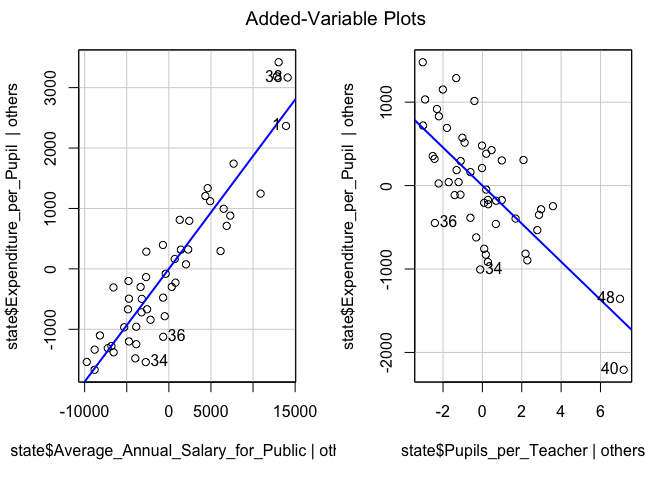<!-- -->

``` r
# ==== Checking Residuals ====
par(mfrow=c(2,2))
plot(model1)
```

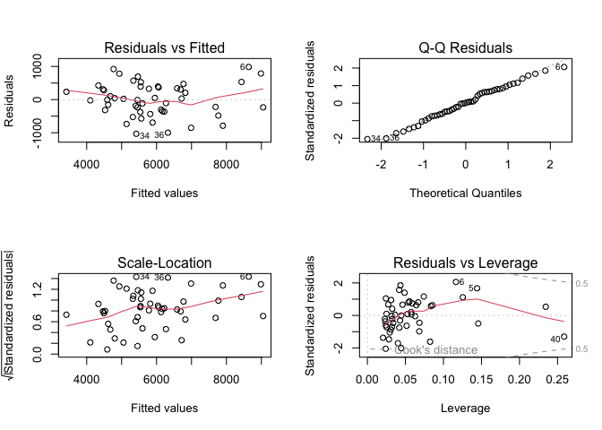<!-- -->

``` r
library(olsrr)
```

    ## 
    ## Attaching package: 'olsrr'

    ## The following object is masked from 'package:datasets':
    ## 
    ##     rivers

``` r
ols_test_normality(model1)
```

    ## -----------------------------------------------
    ##        Test             Statistic       pvalue  
    ## -----------------------------------------------
    ## Shapiro-Wilk              0.9859         0.8094 
    ## Kolmogorov-Smirnov        0.0732         0.9339 
    ## Cramer-von Mises          4.1667         0.0000 
    ## Anderson-Darling          0.1695         0.9296 
    ## -----------------------------------------------

``` r
## Residuals Assumptions:
# 1. normality and homogenity of variance 
# 2. residuals are independent 
  ## both assumptions met 
```
